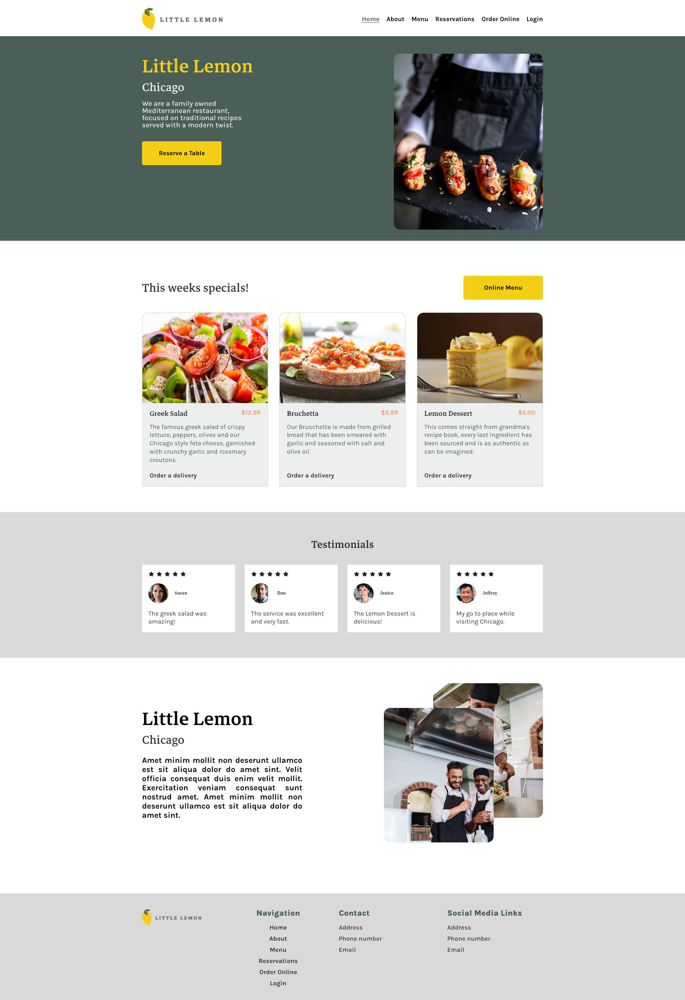
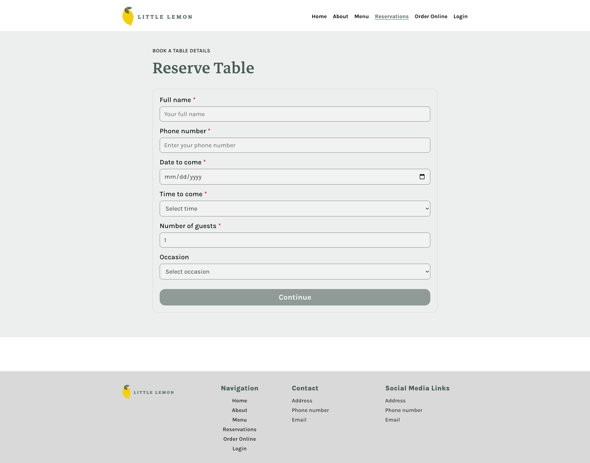
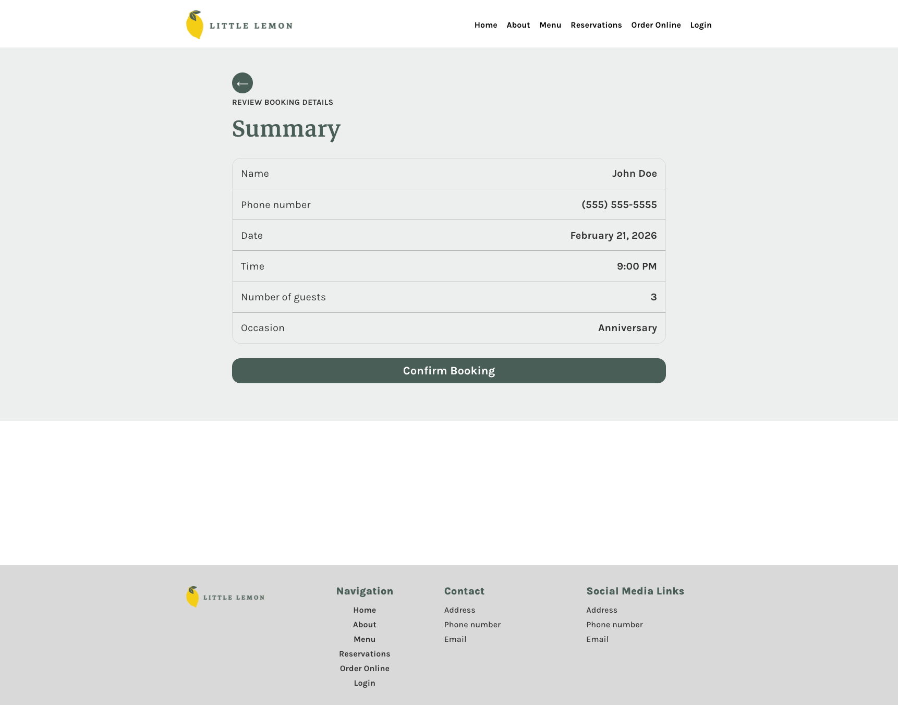

# Little Lemon Booking App

## Overview
This project is the final capstone for the Meta Front-End Developer program. It is a React single-page application for the Little Lemon restaurant, focused on a complete table reservation flow: selecting booking details, validating input, reviewing the reservation, and confirming the booking.

The implementation follows the project exercises in `Context/`, including state management with React hooks, API integration behavior for booking times, accessibility improvements, and unit testing.

## Functionality
The app includes three primary user flows:

- **Homepage (`/`)**: Displays Little Lemon landing content (hero, specials, testimonials, about) and shows a dismissible confirmation banner after successful booking.
- **Booking Page (`/booking`)**: Provides a controlled booking form with fields for full name, phone number, date, time, guests, and occasion.
- **Review and Confirm (`/confirmed`)**: Displays a booking summary before final confirmation, with options to go back and edit or confirm booking.

Booking features include:

- Dynamic time options based on selected date using `fetchAPI`.
- Submission using `submitAPI` and post-confirm navigation.
- Local storage persistence of confirmed bookings.
- Client-side validation using both HTML5 attributes and React logic.
- Field-level inline error messages with meaningful feedback.

## UX/UI Implementation
The UI follows the Little Lemon capstone design intent:

- Structured sections for homepage content and booking flow.
- Consistent visual styling and reusable layout patterns.
- Dedicated review step to reduce accidental submissions.
- Responsive behavior through media queries across app sections.

## Accessibility and Semantics
The app applies accessibility-focused markup and behaviors:

- Semantic elements such as `header`, `main`, `nav`, `section`, `article`, `figure`, `footer`, and `form`.
- Proper label-to-input mapping with `htmlFor` and matching `id`.
- ARIA usage for interactive controls and assistive feedback (for example `aria-label`, `aria-live`, `aria-invalid`, and `aria-describedby`).
- Accessible confirmation/status messaging and dismiss controls.

## Validation and Error Handling
Form validation combines native browser rules and React checks:

- Required fields for name, phone, date, time, and guests.
- Guest constraints enforced with `min="1"` and `max="10"`.
- Phone number validation (10-digit rule).
- Submit button stays disabled until required data is valid.
- Inline errors shown per field after blur/submit attempt.

Edge-case handling includes:

- Safe formatting fallbacks in the review screen when values are missing or malformed.
- Date changes triggering updated available times.
- Optional occasion field supported without blocking submit.

## State Management and API Integration
- `useReducer` manages available reservation times in `Main`.
- `initializeTimes()` loads initial times using `fetchAPI(new Date())`.
- `updateTimes()` refreshes available times when the selected date changes.
- Form state is lifted and shared through `Main` and `BookingPage`.
- `submitAPI(formData)` is called during booking confirmation.

## Unit Testing
Unit tests are written with Jest and React Testing Library and cover:

- Static rendering checks in `BookingForm`.
- Reducer helpers (`initializeTimes`, `updateTimes`).
- Validation behavior for valid and invalid form states.
- Required-field HTML attributes and input constraints.
- Reservation flow behavior (continue to review, confirm booking, localStorage write, navigation outcomes).

## Project Structure
- `src/App.js`: Root layout composing header, main content, and footer.
- `src/Main/Main.js`: Route definitions, booking state, reducer logic, submit flow.
- `src/Main/BookingPage.js`: Validation logic and booking-form orchestration.
- `src/Main/BookingForm.js`: Controlled form UI and accessible field bindings.
- `src/Main/ConfirmedBooking.js`: Review and confirmation step.
- `src/utilities.js`: `fetchAPI` and `submitAPI` functions.
- `src/Main/Main.test.js`: Booking flow and reducer behavior tests.
- `src/Main/BookingForm.test.js`: Form rendering and validation attribute tests.

## Screenshots




## Setup and Evaluation
### Prerequisites
- Node.js (LTS recommended)
- npm

### Run locally
```bash
npm install
npm start
```

Open `http://localhost:3000` in your browser.

### Run tests
```bash
npm test
```

### Production build
```bash
npm run build
```

## Technologies Used
- React
- React Router DOM
- JavaScript (ES6+)
- CSS3
- React Testing Library
- Jest (`react-scripts` test runner)
- Create React App

## Grading Criteria Coverage
This project README and implementation address the capstone grading points:

- **UX/UI implementation**: Booking flow and Little Lemon page sections are implemented in a user-centered flow.
- **Accessibility tags**: Semantic structure, ARIA attributes, and form labeling are in place.
- **Unit tests**: Booking and validation behavior are covered in automated tests.
- **Functional booking form with validation**: Controlled inputs, dynamic times, and submit gating are implemented.
- **Semantics and responsiveness**: Semantic HTML and responsive CSS media queries are used throughout.
- **Git repository usage**: Project is maintained in a Git repository with version-controlled source.
- **Clear, maintainable structure**: Components are split by responsibility and organized by feature area.
- **Edge cases and meaningful errors**: Input edge cases are handled and user-facing validation feedback is provided.
- **Documentation and setup**: This README documents architecture, behavior, and exact setup/run/test steps.

## Learning Objectives Demonstrated
- Building reusable React components and route-based page flows.
- Managing local and shared state with `useState` and `useReducer`.
- Integrating API-driven data into form interactions.
- Implementing robust client-side validation and feedback.
- Writing and maintaining unit tests for UI and state logic.
- Applying accessibility and semantic HTML best practices.
